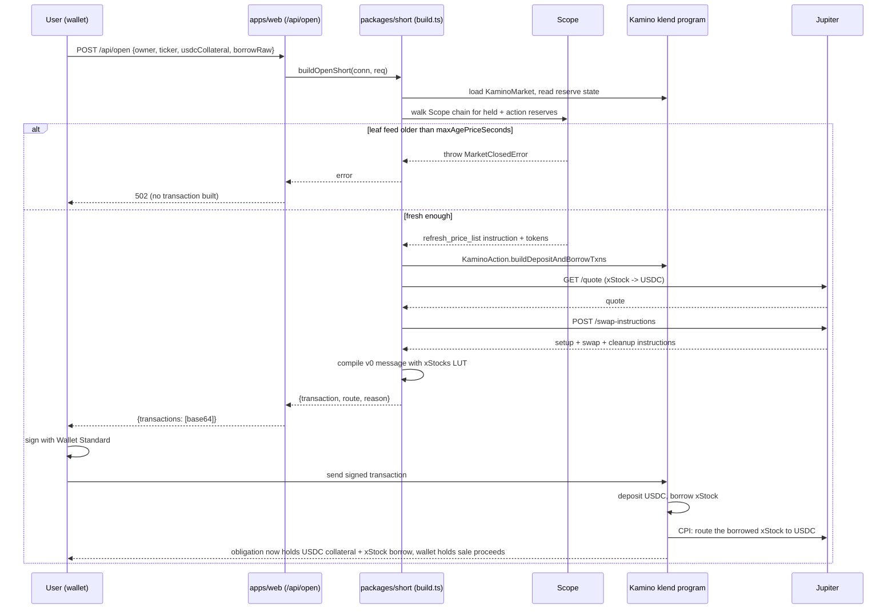
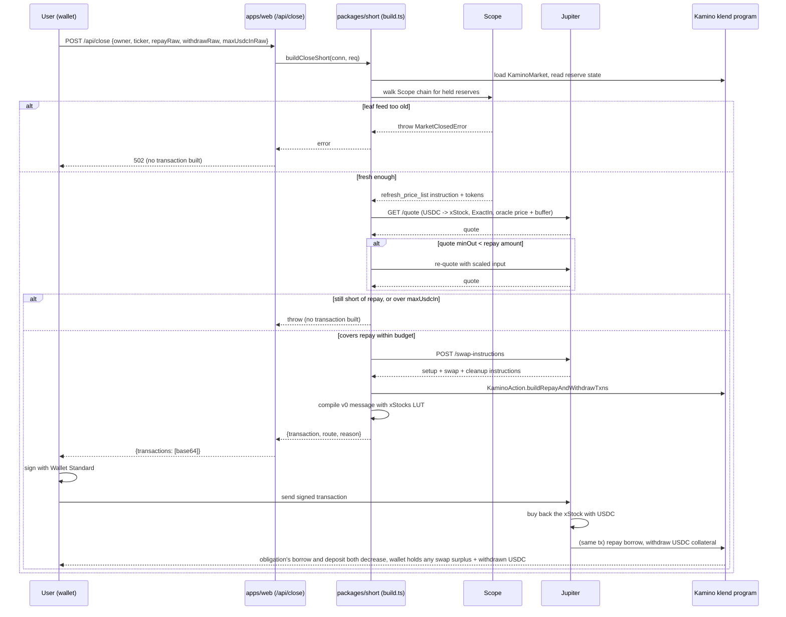

# Contra architecture

## Components

**`packages/short/src`** is the protocol layer; it never touches a private key and returns unsigned transactions.

- `constants.ts`: pins the xStocks Market address (`5wJeMrUYECGq41fxRESKALVcHnNX26TAWy4W98yULsua`), the klend program id (`KLend2g3cP87fffoy8q1mQqGKjrxjC8boSyAYavgmjD`), USDC's mint, and the Kamino-published lookup table for this market (`8ofreL6hKfEet1DnhHVGvCTnSdz4pg85PpbuCUHnEcKm`, verified on-chain: active, 95 entries covering the market, its reserves, Scope price accounts, and the klend program).
- `rpc.ts`: resolves one RPC URL (`SOLANA_RPC_URL`, then `RPC_URL`, then the public mainnet endpoint) into both a `@solana/web3.js` `Connection` (simulate, `getAccountInfo`) and a `@solana/kit` `Rpc` (required by klend-sdk).
- `market.ts` / `reserves.ts`: load the `KaminoMarket` via klend-sdk and read every reserve's deployed config directly: max LTV, liquidation threshold, borrow factor, available liquidity, borrow limit, and remaining borrow-cap headroom. A reserve is borrowable only when it has both available liquidity and remaining cap room; this is the same computation `apps/web/src/lib/reserves.ts` calls for `/api/reserves`.
- `scope.ts`: Kamino prices every reserve through a Scope chain of derived entries (`CappedFloored`, `MostRecentOf`, `ScopeTwap`) built from leaf feeds (`ChainlinkX`, `PythLazer`). `buildScopeRefresh` walks that chain, builds one `refresh_price_list` instruction covering every derived entry the transaction's reserves touch, and throws `MarketClosedError` before building anything if a leaf is older than the reserve's `maxAgePriceSeconds` — a fresh refresh of a derived entry can't outrun a stale leaf underneath it.
- `jupiter.ts`: calls Jupiter's `/swap/v1/quote` and `/swap/v1/swap-instructions` (not `/swap`), because raw instructions compose into the same v0 message as the Kamino instructions instead of arriving as a separate pre-built transaction.
- `pyth.ts`: resolves the `Equity.US.<TICKER>/USD` Hermes feed and gates on two independent facts: `market_hours.is_open` (free, no key) and the latest price's age against `PYTH_API_KEY`-gated `/v2/updates/price/latest`. This is separate from Kamino's Scope oracle; it's the feed the product uses for P&L and staleness display.
- `build.ts`: assembles `buildOpenShort` and `buildCloseShort`: Kamino instructions via klend-sdk's `KaminoAction`, the Jupiter leg, the Scope refresh, one compute-budget instruction, and the xStocks-market lookup table, compiled into a v0 `VersionedTransaction`. Falls back to two transactions only if the combined message exceeds Solana's 1232-byte limit.
- `simulate.ts` / `simulate-close.ts`: mainnet proof scripts. Build a real transaction for a real funded Kamino obligation (found by scanning live obligations in `packages/short/spikes/`), run `simulateTransaction` with `sigVerify:false` and a replaced blockhash, and write pre-state plus simulated post-state account bytes to `artifacts/*.json`. They never sign or send.
- `check.mjs` / `check-close.mjs`: independent verifiers. They do not import `build.ts`; they re-decode the artifact's raw account bytes with klend-sdk's own generated `Obligation`/`Reserve` layouts and assert the balance-level post-conditions described in the README's evidence table.

**`apps/web`** (Next.js) is the interface: `/api/reserves` (GET, live reserve rows), `/api/open` and `/api/close` (POST, build a transaction from `@contra/short` and return it base64-encoded, unsigned), `/api/hedge` (a related hedge-sizing helper), plus the `/`, `/hedge`, and `/positions` pages. The browser signs and sends via the Wallet Standard (`apps/web/src/lib/wallet.ts`), never a private key on the server.

## Trust boundaries

- The server never holds a signing key. `buildOpenShort`/`buildCloseShort` take a `readOnlySigner` for the owner address and return an unsigned transaction; `apps/web/src/lib/wallet.ts` is where a real signature is produced, in the browser, via the Wallet Standard.
- Kamino's klend program, Jupiter's router, and Scope's oracle program are trusted on-chain code this project composes instructions for; Contra's own code never custom-signs or bypasses their instruction handlers.
- Price truth for gating comes from two independent places: Kamino's own Scope chain (what klend actually checks on-chain) and Pyth Hermes (what the product displays and uses for P&L). Contra refuses to build a transaction rather than guess a price when either is stale or unavailable.
- `check.mjs`/`check-close.mjs` are a second trust boundary inside the repo itself: they deliberately avoid importing `build.ts`, so a bug in the transaction builder can't also hide itself from the checker.

## Why one v0 transaction

A v0 message has a hard 1232-byte wire limit. An open short needs, in order: a compute-budget instruction, an optional Scope `refresh_price_list` (which Scope requires to sit immediately after the compute-budget instruction), Kamino's deposit and borrow instructions, and Jupiter's swap setup/swap/cleanup instructions. Two things make that fit in one message often enough to matter: Jupiter's swap-instructions endpoint returns raw instructions instead of a wrapped transaction, so they compose directly; and the xStocks-market lookup table (95 entries: the market, every reserve, every Scope price account, the klend program) collapses most of the account list from full 32-byte keys to 1-byte indices. `build.ts` still measures the compiled message and falls back to two transactions, Kamino first then Jupiter, only when a wider Jupiter route (observed: Byreal near 1232 bytes, Riptide near 1165) pushes the combined message over the limit.

## Open-short sequence

## Close-short sequence

